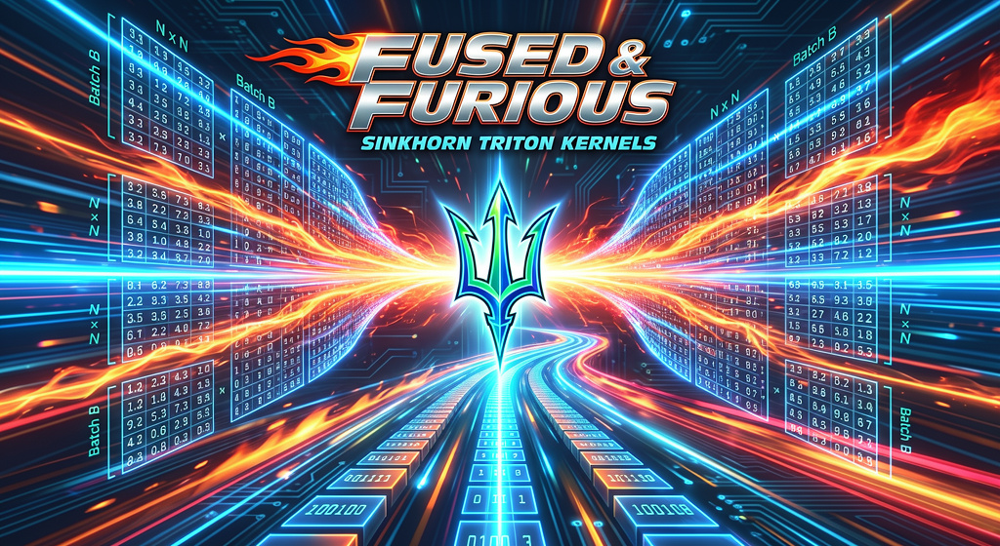
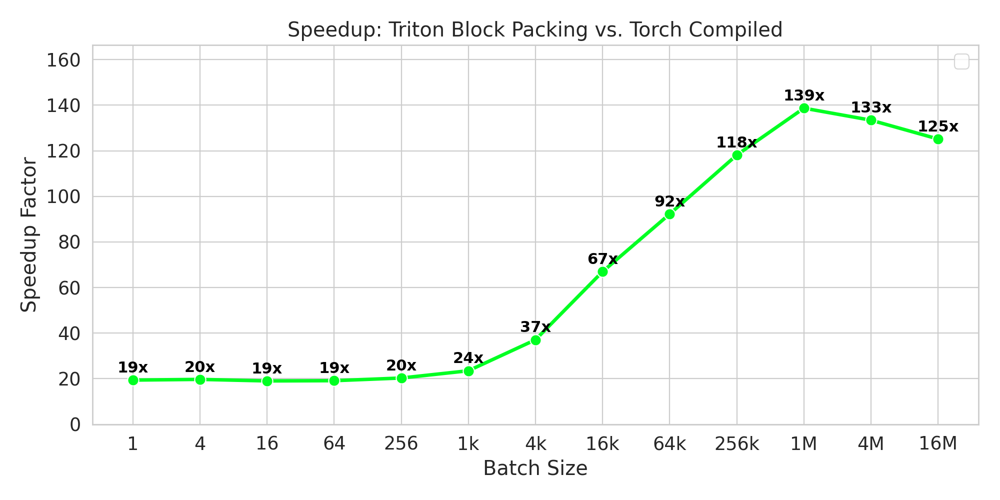
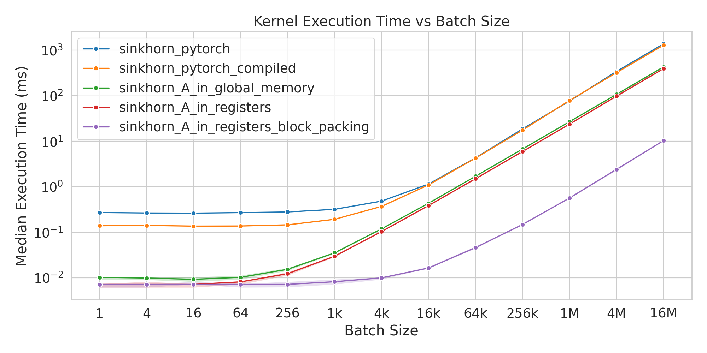
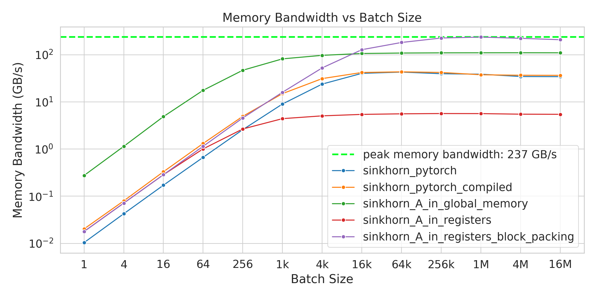
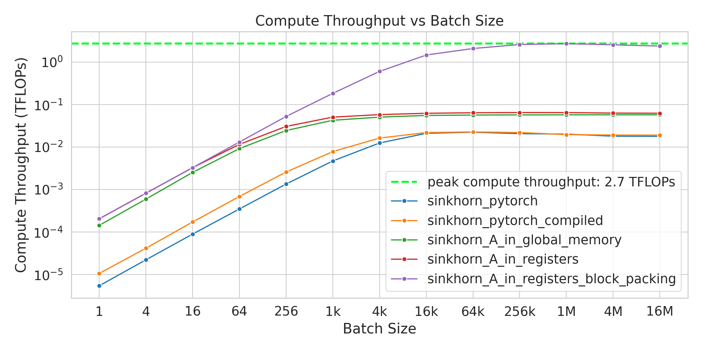

# Fused & Furious: Sinkhorn Triton Kernels

<div align="center">
  
</div>

<hr>

### This repository provides an I/O-aware implementation of Sinkhorn's algorithm using Triton kernels for fast computation on GPUs.

- At large batch sizes with $N=4$ and $n_{iter}=20$, **it beats the corresponding compiled PyTorch implementation by ~130x** (and ~20x at smaller batch sizes) on a single *NVIDIA RTX 4000 Ada Generation* GPU.

- The kernel is designed to process tensors of shape `(B, N, N)` where `B` is the batch size and `N` is the matrix size. It's highly optimized for the value $N=4$, as proposed in the [<i>m</i>HC](https://arxiv.org/abs/2512.24880) paper.

- More details can be found in my [blog post](https://gaetanX21.github.io/blog/fused-and-furious/).

## Installation

Just need some common Python packages + Triton (and a GPU!)
```bash
pip install torch triton pandas matplotlib seaborn
```

## Usage


### Basic Run

```bash
python benchmark.py
```

Will run the benchmark using the default settings:
- matrix size `N=4`
- number of iterations `n_iter=20`
- batch size sweep from 1 to 16M with 4x steps

The script will automatically generate plots and a CSV file with the results. It should run entirely in <1 min with the default settings.

### Custom Parameters

| Argument | Type | Default | Description |
| :--- | :--- | :--- | :--- |
| `N` | `int` | `4` | Matrix size ($N \times N$). Best performance when $N \le 16$. |
| `n_iter` | `int` | `20` | Number of Sinkhorn iterations. Increase for better convergence. |
| `epsilon` | `float` | `1e-6` | Numerical stability constant. |
| `log2_B_min` | `int` | `0` | Starting exponent for Batch Size ($B_{min} = 2^{log\_2\_B\_min}$). |
| `log2_B_max` | `int` | `24` | Ending exponent for Batch Size (inclusive, $B_{max} = 2^{log\_2\_B\_max}$). |
| `log_2_B_step` | `int` | `2` | Step size for the exponent sweep (e.g., $2^0, 2^2, 2^4 \dots$). |

You can easily customize the parameters using command line arguments:
```bash
python benchmark.py --N 8 --n_iter 50 --log2_B_min 0 --log2_B_max 20 --log_2_B_step 1
``` 

## Results

Here are the plots generated with the default settings on a *NVIDIA RTX 4000 Ada Generation* GPU.

<div align="center">
    
    <br>
    <em><b>Figure 1:</b> For batch sizes below 1k, both the naive PyTorch function and the optimized Triton kernel operate in the latency-bound regime, hence the speedup is roughly constant (and scales with <code>n_iter</code>). Past this threshold, we enter the memory-bound regime where the Triton kernel's I/O awareness shines.</em>
</div>

<br>

<div align="center">
  
    <br>
    <em><b>Figure 2:</b> Comparison of median execution time for various implementations of Sinkhorn's algorithm. The shading represents the 99% confidence interval (<code>q01</code> to <code>q99</code>). For batch sizes below 1k, we operate in the latency-boung regime (i.e. some of the GPUs SMs are idle) and as such execution time is roughly constant. Past this threshold, we enter the memory-bound regime where execution time scales linearly with batch size.</em>
</div>

<br>

<div align="center">
    
    <br>
    <em><b>Figure 3:</b> Memory bandwidth increases linearly with batch size in the latency-bound regime as we distribute the work to more SMs, then saturates in the memory-bound regime. Note the peak bandwidth of 238 GB/s, satisfyingly close to the hardware limit of 360 GB/s for this GPU. Note that the memory bandwidth decreases as <code>n_iter</code> increases, which is expected as we spend more time computing inside the registers and less time exchanging data between global memory and registers. For <code>n_iter=1</code> we get 312 GB/s peak I/O bandidth i.e. 87% of the hardware limit.</em>
</div>

<br>

<div align="center">
    
    <br>
    <em><b>Figure 4:</b> Like memory bandwidth, compute throughput increases linearly with batch size in the latency-bound regime, then saturates in the memory-bound regime. Note the peak throughput of 2.7 TFLOPS, which is very far from the hardware limit of 26 TFLOPS for this GPU. This isn't surprising as Sinkhorn's algorithm is memory-bound.</em>
</div>